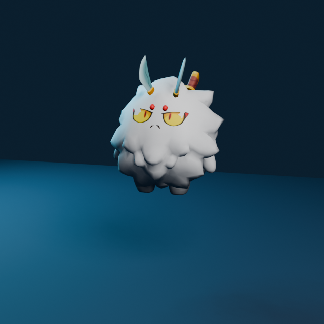
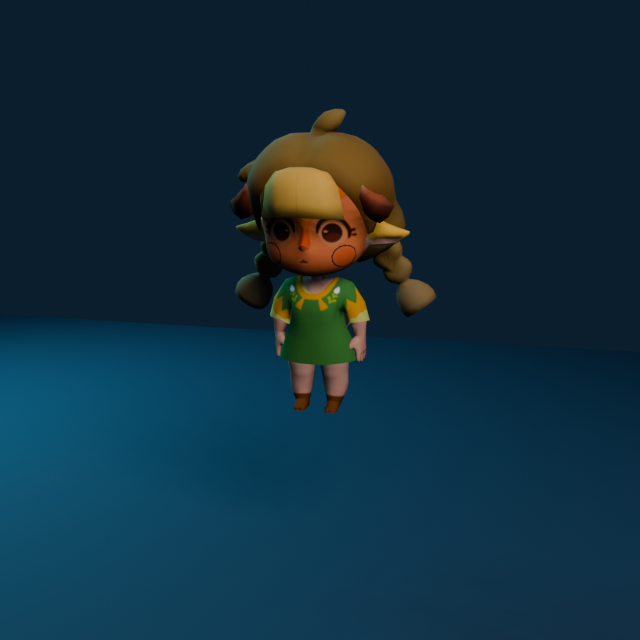

# Axie 3D Assets

Beginner-friendly, game-ready 3D characters for Axie Vibeathon and other Axie programs approved by Sky Mavis.

Every character is provided as one self-contained **GLB** with its mesh, textures, skeleton, and animation clips embedded. You can use the files in Three.js, Unity, Godot, Blender, Babylon.js, PlayCanvas, or another tool with glTF 2.0 support.

| Axie mascot | Sapidae |
| --- | --- |
|  |  |

## What is included

- **7 animated Axie mascots:** Bing, Kibo, Kotaro, Paladill, Pomodoro, Tripp, and Xia
- **10 animated Sapidae variants:** F-A through F-E and M-A through M-E
- **Idle, walk, and run** on every character
- Character-specific greeting, combat, skill, and defeat clips where available
- Optional static equipment GLBs for the mascot set
- A small browser previewer for trying every character and clip

Browse the exact files and clips in [the asset catalog](./docs/ASSET_CATALOG.md).

## Fastest way to start

1. Open `assets/mascots/` or `assets/sapidae/`.
2. Download one `.glb` file.
3. Import it into your engine.
4. Play the `Idle`, `Walk`, or `Run` animation.

The GLBs do not need a separate texture folder or animation download.

For engine-specific steps and copy-paste examples, read [Getting started](./docs/GETTING_STARTED.md).

## Preview everything locally

```sh
git clone https://github.com/jaatster/axie-3d-assets.git
cd axie-3d-assets
npm install
npm run dev
```

Open `http://127.0.0.1:5173/`, select a character, and click its animation buttons.

Before publishing or changing an asset, run:

```sh
npm test
```

This validates all GLBs, embedded resources, skeletons, expected animation names, checksums, the public repository surface, and the preview build.

## Coordinate system and format

- Format: binary glTF 2.0 (`.glb`)
- Up axis: Y in glTF-compatible game engines
- Character origin: near the feet
- Textures: embedded
- Animations: embedded and named

Importers may display scale differently. Set the character's scene scale once in your engine rather than editing every animation.

## Equipment

Equipment files are optional static props. Mascot combat clips are still usable without them. Attaching equipment to an animated hand or weapon socket is engine-specific, so treat that as an advanced step after the base character is moving correctly.

## Usage permission

These assets are not a general-purpose open-source or public-domain asset pack. Read [RIGHTS.md](./RIGHTS.md) before using or redistributing them.
